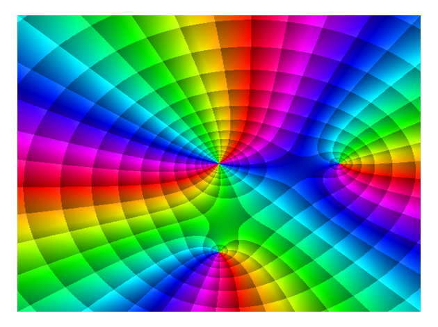
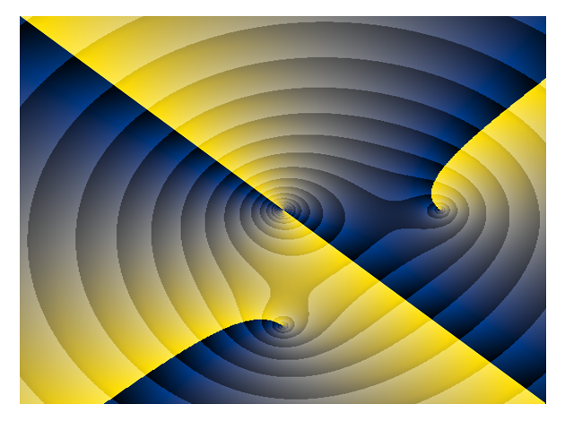
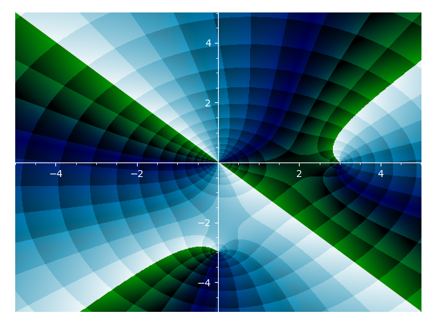

# phase_mag_plot

This repository contains some sage/cython code for producing plots with
logarithmic contouring. At some point in the future, I intend to put this (and
related) functionality directly into sage, but for now this is where this
lives.

This is designed to work with a relatively up-to-date version of sage running
python3. I have not tested it with python2.

To use this code right now, use `load("phase_mag_plot.spyx")` from a running
sage session, and then `phase_mag_complex_plot` to produce a plot. The arguments and
description of `phase_mag_complex_plot` is almost identical to those of
`complex_plot` within sage. The resulting plot can be manipulated in the same
matplotlib-inspired ways as other graphics in sage.

Note also that the contours are more sensitive the the argument `plot_points`
than the coloration; to produce high-quality images, it is necessary to use
several plotting points.

    ~$ git clone https://github.com/davidlowryduda/phase_mag_plot
    ...
    ~$ cd phase_mag_plot
    ...
    sage: load("phase_mag_plot.spyx")
    Compiling ./phase_mag_plot.spyx...
    sage: phase_mag_complex_plot(sqrt(x), (-5, 5), (-5, 5), plot_points=400)
    # produces a plot of the square root function

    # note that standard plotting tooling is still available, eg
    g = phase_mag_complex_plot((x-3)*(x+3*i)*x^2, (-5, 5), (-5, 5), plot_points=500)
    g.show()

    g.axes(show=False)
    g.show()

This also includes a tile-type contour (inspired heavily from the domain
coloring methods of Elias Wegert) that can be activated by calling
`tiled=True`. For example,

    g = phase_mag_complex_plot((x-3)*(x+3*i)*x^2, (-5, 5), (-5, 5), tiled=True, plot_points=500)
    g.axes(show=False)
    g.show()

If you encounter any bugs or have any questions, let me know.

# colormapplot

This repository also contains a version of colormapplot. This is a plotting
routine with similar calling semantics as `phase_mag_complex_plot` and sage's
default `complex_plot`, but which allows one to use matplotlib compatible
colormaps to source the colors.

**Note** that this is not currently indexed in the reference Zenodo
implementation.

For example,

    # After loading color_complex_plot
    g = color_complex_plot((x-3)*(x+3*i)*x^2, (-5, 5), (-5, 5), plot_points=500)
    g.axes(show=False)
    g.show()

By default, the colormap is chosen to be the `cividis` colormap. See
[Optimizing colormaps with consideration for color vision deficiency to enable
accurate interpretation of scientific
data](https://journals.plos.org/plosone/article?id=10.1371/journal.pone.0199239)
by Nunez, Anderton, and Renslow for more information about this particular
colormap.

This can handle any matplotlib compatible colormap. For example, if you prefer
the colormap `ocean`, then you can use

    import matplotlib.cm
    g = color_complex_plot((x-3)*(x+3*i)*x^2, (-5, 5), (-5, 5),
                           cmap=matplotlib.cm.ocean,   # <--- new line
                           tiled=True, plot_points=500)
    g.axes_color('white')
    g.axes_label_color('white')
    g.tick_label_color('white')
    g.show()

I don't know why you would choose this colormap. And this colormap shows that
certain defaults have been chosen that don't quite apply equally.

Not all functions look equally good in all colormaps, but now you can try them
out.

## License

This is closely modified from sage itself, and thus it is available under
GPLv3+. A copy of this license is included in this repository, and a link is
available in each source file.
