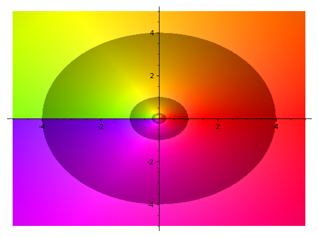
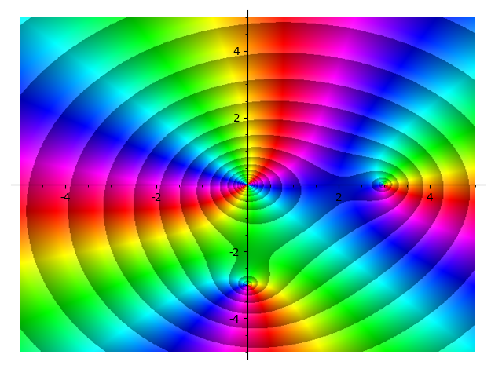
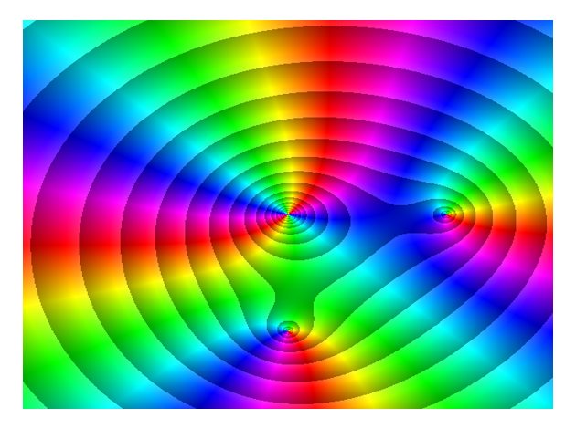

# phase_mag_plot

This repository contains some sage/cython code for producing plots with
logarithmic contouring. At some point in the future, I intend to put this (and
related) functionality directly into sage, but for now this is where this
lives.

This is designed to work with a relatively up-to-date version of sage running
python3. I have not tested it with python2.

To use this code right now, use `load("phase_mag_plot.spyx")` from a running
sage session, and then `phase_mag_complex_plot` to produce a plot. The arguments and
description of `phase_mag_complex_plot` is almost identical to those of
`complex_plot` within sage. The resulting plot can be manipulated in the same
matplotlib-inspired ways as other graphics in sage.

Note also that the contours are more sensitive the the argument `plot_points`
than the coloration; to produce high-quality images, it is necessary to use
several plotting points.

    ~$ git clone https://github.com/davidlowryduda/phase_mag_plot
    ...
    ~$ cd phase_mag_plot
    ...
    sage: load("phase_mag_plot.spyx")
    Compiling ./phase_mag_plot.spyx...
    sage: phase_mag_complex_plot(sqrt(x), (-5, 5), (-5, 5), plot_points=400)
    # produces a plot of the square root function

    # note that standard plotting tooling is still available, eg
    g = phase_mag_complex_plot((x-3)*(x+3*i)*x^2, (-5, 5), (-5, 5), plot_points=500)
    g.show()

    g.axes(show=False)
    g.show()

If you encounter any bugs or have any questions, let me know.

## License

This is closely modified from sage itself, and thus it is available under GPLv3.
A copy of this license is included in this repository, and a link is available
in each source file.
